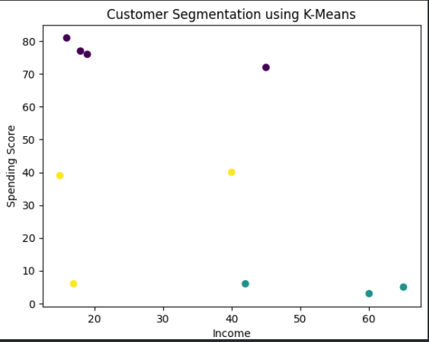

# Customer Segmentation using K-Means Clustering

## Overview
This project uses K-Means Clustering to segment customers based on their Income and Spending Score.

Customer segmentation helps businesses identify different customer groups and create targeted marketing strategies.

## Technologies Used
- Python
- Pandas
- Scikit-Learn
- Matplotlib

## Machine Learning Concepts
- Data Preprocessing
- Feature Scaling
- K-Means Clustering
- Customer Analytics
- Data Visualization

## Features
- Groups customers into clusters
- Visualizes customer segments using a scatter plot
- Helps understand customer purchasing behavior

## Output

## Future Improvements
- Use larger real-world datasets
- Optimize cluster selection using the Elbow Method
- Add interactive visualizations
